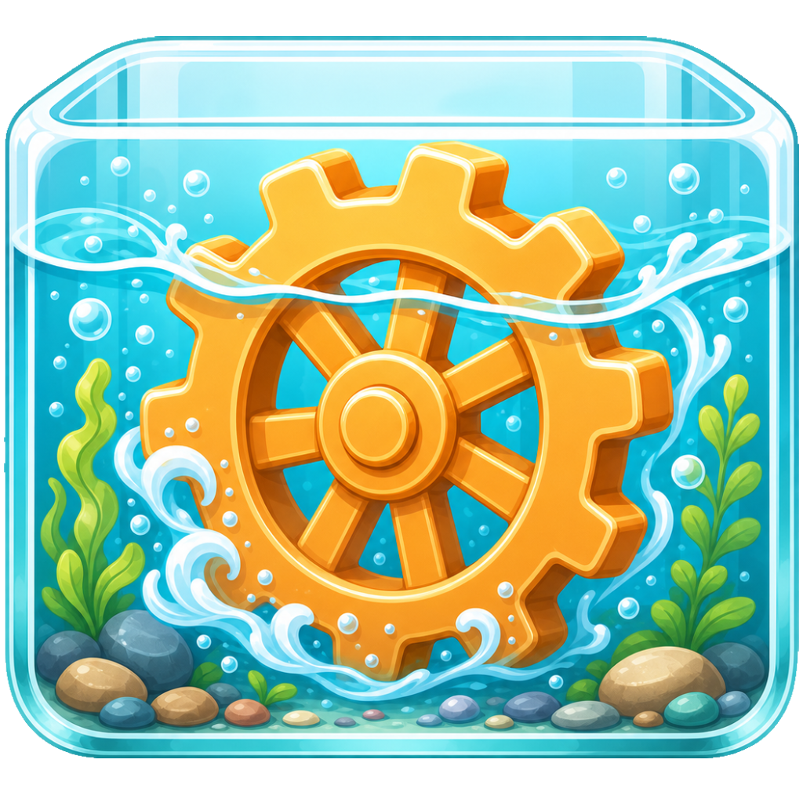

# Aquarium Engine



C# engine core for Aquarium: a native, owned renderer and interaction runtime
for a living Epiphany client.

## Intent

- C# host with renderer architecture kept legible in Rider.
- Vortice/D3D12 renderer spine with the native boundary kept explicit.
- DirectWrite/Direct2D overlay text after the scene pass for crisp debug and UI
  typography.
- Grid-centered camera and world-space interaction invariants as first-class
  engine contracts.
- Diegetic UI surfaces driven by Aquarium objects instead of admin chrome.
- CultNet for Epiphany communication.
- CultCache for settings, persistent client state, and reload recovery.
- Procedural audio and visual state treated as coupled signals.

## Current Shape

The engine opens a Win32 window, owns a D3D12 swapchain, renders the visible
Aquarium world in HLSL, and draws crisp overlay text through DirectWrite. The
camera target is the Grid center. Grid radius follows zoom distance. Body anchors
remain world-space.

The Epiphany client is split behind `Aquarium.Engine.Contracts`, so client code
can reload while the engine host, window, renderer, and D3D device stay alive.
Runtime state is banked through CultCache MessagePack documents instead of loose JSON.

## Run

Aquarium currently expects the sibling `CultMath` and `CultLib` repos at
`E:\Projects\CultMath` and `E:\Projects\CultLib`, or the equivalent
`..\..\..\CultMath` / `..\..\..\CultLib` paths from the engine project.

```powershell
dotnet build Aquarium.Engine.slnx
dotnet run --project src\Aquarium.Engine\Aquarium.Engine.csproj -- --client-assembly src\Aquarium.Epiphany\bin\Debug\net10.0\Aquarium.Epiphany.dll
```

For Rider, open `Aquarium.Engine.sln`. The `.slnx` stays as the compact
CLI-friendly solution, but Rider may show empty project trees when opening it.

`src\Aquarium.Sample.Minimal` is a tiny non-Epiphany client used to keep the
engine boundary honest. It references only `Aquarium.Engine.Contracts`, declares
an `AquariumRenderPlan`, and boots through the same host/client loader path.

For iteration while an Aquarium window is already open, use the dev reload
runner instead of `dotnet run`:

```powershell
.\scripts\dev-reload.ps1
```

It builds an apphost executable into a fresh disposable slot under
`artifacts\dev-reload`, records the slot/PID in PowerShell CLIXML, and launches
the runtime with a MessagePack CultCache store at
`artifacts\dev-reload\cultcache\aquarium-client.msgpack`.
The previous script-owned process is stopped only after the replacement build
succeeds. This keeps MSBuild away from the locked normal `bin\Debug` output
while a live window is still open.

If the visible dev window was closed but the last slot is still present, reopen
it without rebuilding:

```powershell
.\scripts\dev-reload.ps1 -Reopen
```

Visible and headless runs keep separate PID state and logs, so a headless smoke
does not replace the visible dev window.

For automatic rebuild/restart on source changes, use the watcher:

```powershell
.\scripts\dev-watch.ps1
```

The watcher polls source files, waits for writes to settle, builds into a new
slot, and only replaces the running Aquarium after the new build succeeds. If a
build fails, the previous good process keeps running and that same broken source
fingerprint is not retried until files change again.
It also watches the recorded script-owned process. If the visible window is
closed or the recorded process dies, the watcher relaunches from a fresh slot on
the next poll instead of sitting there with its hands folded like this is fine.
To reopen a closed visible window from the last good slot without rebuilding,
run the watcher with:

```powershell
.\scripts\dev-watch.ps1 -ReopenWhenClosed
```

Shader edits do not restart the process. The dev reload runner passes the
shader source directory into the live app, and the renderer polls
`D3D12Grid.hlsl`, `D3D12Scene.hlsl`, and `D3D12Post.hlsl`, compiles changed
shaders in the running process, then swaps the D3D shader objects only after
compilation succeeds. A bad shader edit leaves the previous working shaders
bound and writes the compiler failure to stderr.

Epiphany client/runtime code is split into `Aquarium.Epiphany` behind
`Aquarium.Engine.Contracts`. The host loads that client DLL through a collectible
assembly load context, while `dev-watch.ps1` builds client-only changes into
`artifacts\dev-reload\live-slots` and updates `live-current.txt`. The running
host sees the pointer change, loads and starts the new runtime first, then
disposes the old one only after the replacement is valid. A bad client DLL leaves
the previous runtime alive and reports the reload failure to stderr. The watcher
waits for the host log to acknowledge the exact client DLL path before calling a
client reload successful; pointer updates without host acknowledgement are treated
as reload failures. Successful reloads rehydrate through CultCache without
restarting the window or D3D device.
Host, renderer, contract, project, script, and `src\Aquarium.Engine\Assets`
content changes still rebuild and restart the apphost. Runtime content belongs
to the process image; shader hot reload cannot make a running renderer discover
new files it never loaded.

Runtime live state is a typed CultCache document, not a loose sidecar file. The
first document is `epiphany.aquarium.live_state`, currently banking camera
target, yaw, pitch, distance, time, and save generation every few frames so a
reload can rehydrate without pretending memory is vibes.

Stop the script-owned Aquarium process:

```powershell
.\scripts\dev-stop.ps1
```

Headless smoke:

```powershell
dotnet run --project src\Aquarium.Engine\Aquarium.Engine.csproj -- --headless --client-assembly src\Aquarium.Epiphany\bin\Debug\net10.0\Aquarium.Epiphany.dll
```

Headless reload smoke without touching the normal build output:

```powershell
.\scripts\dev-reload.ps1 -Headless
```

Renderer/client boundary check:

```powershell
.\scripts\verify-boundaries.ps1
```

Headless watch smoke:

```powershell
.\scripts\dev-watch.ps1 -Headless
```

Shipping publish:

```powershell
.\scripts\publish-win-x64.ps1 -Clean -Zip
```

This writes a self-contained Windows build to
`artifacts\publish\win-x64`, verifies the executable, Epiphany client DLL,
contracts DLL, icon, bundled fonts, and shader source, then optionally creates
`artifacts\publish\EpiphanyAquariumEngine-win-x64.zip`.

## Persistent State

This repo carries its own Aquarium memory:

- `state/map.yaml`: canonical project map and next actions.
- `state/memory.json`: durable taste, doctrine, renderer rules, and warnings.
- `state/evidence.jsonl`: compact lessons that should change future behavior.
- `state/scratch.md`: disposable working context for the current pass.

Keep that state current when the engine learns something durable. Dead lessons
go out with the trash; the repo is not a scrapbook.

## Docs

- `docs/aquarium-engine-doctrine.md`: engine doctrine and invariants.
- `docs/engine-client-boundary.md`: Engine/Epiphany ownership split.
- `docs/epiphany-extraction-render-api-plan.md`: migration plan for the client
  extraction and ergonomic render graph API.
- `docs/vortice-spine.md`: native host/renderer spine.
- `docs/hlsl-renderer.md`: current shader path.
- `docs/input.md`: camera and input contract.
- `docs/cult-runtime-surface.md`: CultCache/CultNet runtime surface.
